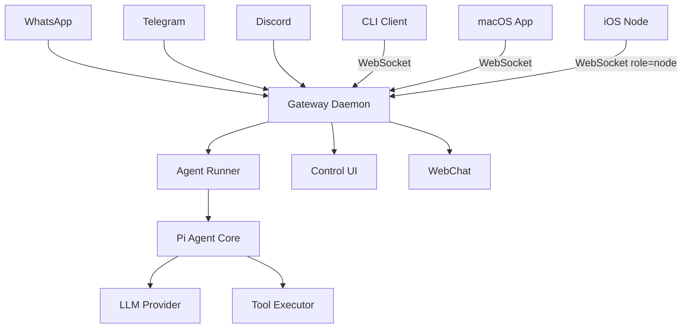
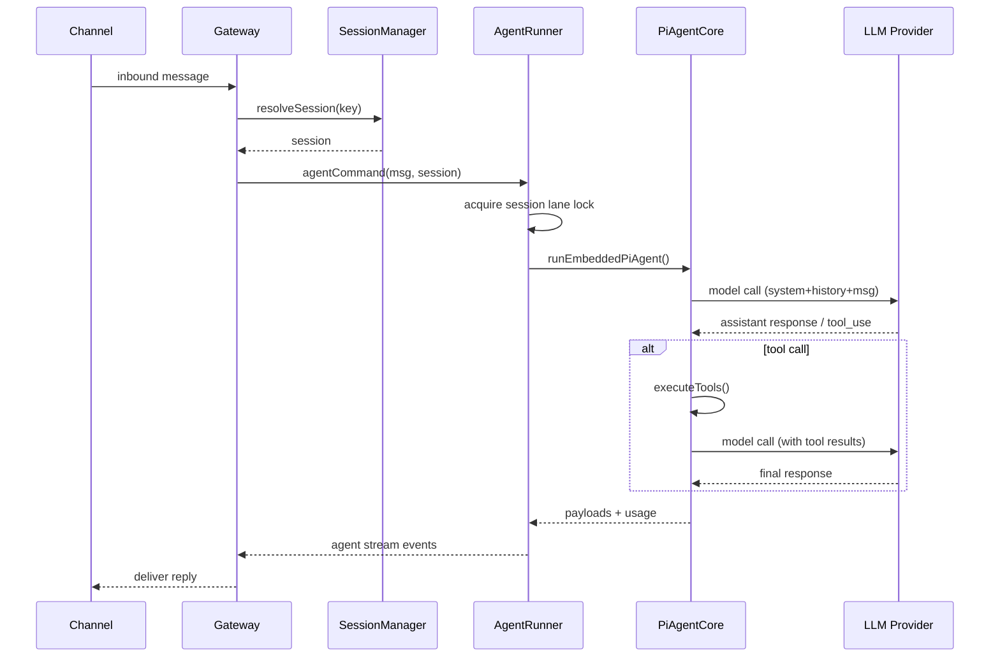
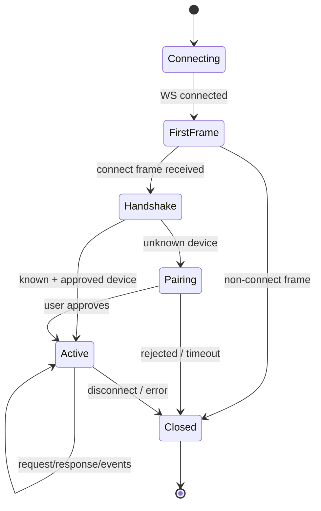

# Repo Documentarian

The final skill in the analysis chain. Turns structured analysis into polished documentation
that developers can actually use.

---

## Prerequisites

Check what context is available:
1. **Repo Inventory Manifest** (from `repo-cartographer`) — needed for README, architecture overview
2. **Technical Analysis document** (from `repo-archaeologist`) — needed for flow docs, API reference, deep guides

If neither exists and the user asked for comprehensive docs, run the cartographer and archaeologist first.
If the user asked for a focused doc type, gather only the information you need for that doc inline.

---

## Document Types & When to Use Each

| Doc type | Triggered by | Requires |
|----------|-------------|---------|
| README | "write a README", "update the README" | Cartographer manifest |
| Architecture Overview | "architecture doc", "system overview", "how does it work" | Both |
| Developer Onboarding Guide | "onboarding guide", "how do I contribute", "new developer guide" | Both |
| Module/Subsystem Reference | "document the gateway", "reference for channel system" | Archaeologist analysis |
| API Reference | "document the API", "RPC reference", "WS protocol docs" | Targeted file reading |
| ADR (Architecture Decision Record) | "why is X done this way", "document design decisions" | Archaeologist analysis |
| Mermaid Diagrams | "draw a diagram", "architecture diagram", "flow diagram" | Archaeologist analysis |
| Full Doc Suite | "document everything", "full documentation" | Both |

---

## Phase 1 — Gather Missing Context

If the relevant input documents don't exist, gather what you need:

For README or Architecture Overview:
```bash
cat README.md 2>/dev/null
cat VISION.md 2>/dev/null
cat CONTRIBUTING.md 2>/dev/null
cat package.json 2>/dev/null | head -30
```

For Module Reference — read the module's main export files:
```bash
find src/<module>/ -name "index.ts" -o -name "*.ts" | head -10
# Then read each
cat src/<module>/index.ts
```

For API Reference — find the API definition:
```bash
grep -rn "method\|route\|RPC\|handler" src/ --include="*.ts" | grep -v test | head -30
# Read the protocol/schema files
find src -name "*protocol*" -o -name "*schema*" -o -name "*types*" | grep "\.ts$" | head -10
```

---

## Phase 2 — Write the Documentation

### DOC TYPE: README

A great README has exactly these sections in this order:

```markdown
# <Project Name>

<Tagline — one sentence that explains what it is and who it's for.>

[] [] []

**<Project Name>** is a <type of software> that <core value proposition>.
<2-3 sentences about the key differentiator vs alternatives.>

## Quick Start

<Minimal steps to get running. Prefer copy-paste commands.>

\```bash
npm install -g <package>
<package> onboard
\```

## What It Does

<3-5 bullet points of the most important features. Be specific, not vague.>

- **Feature**: <concrete description>
- **Feature**: <concrete description>
- ...

## Architecture

<Optional for simple tools; essential for complex systems. 2-3 paragraphs max.
Link to full architecture doc if one exists.>

## Installation

<Full installation options: npm/pip/brew/docker/from source.>

## Configuration

<Minimal config example + link to full reference.>

## Development

<How to clone, build, run tests, and run locally.>

\```bash
git clone <repo>
pnpm install
pnpm gateway:watch
\```

## Documentation

<Links to docs by goal/audience.>

## Contributing

<One paragraph + link to CONTRIBUTING.md.>

## License

<License line.>
```

**Writing rules for README:**
- Lead with value, not features
- Every code block must be copy-paste runnable
- Use concrete numbers/names when known ("supports 23 messaging platforms" not "supports many platforms")
- Link every jargon term on first use
- "Quick Start" should work in under 5 minutes

---

### DOC TYPE: Architecture Overview

```markdown
# Architecture Overview: <Project Name>

## The One-Paragraph Summary

<The single most important paragraph a new engineer should read. Covers: 
what the system does, what its top-level components are, how they relate,
and what technology it's built on. Should be usable as an elevator pitch
to another engineer.>

## System Diagram

\```
[Diagram in ASCII or Mermaid — see Mermaid Diagrams section]
\```

## Components

### <Component 1> (e.g. Gateway)
**Role:** <one sentence>
**Code location:** `<path>`
**Key responsibilities:**
- <responsibility>
- <responsibility>
**Key interfaces:** <what it exposes to other components>
**Dependencies:** <what it depends on>

### <Component 2>
...

## Data Flows

### <Flow 1> (e.g. "Inbound message processing")
\```
Step 1 → Step 2 → Step 3 → ... → Final action
\```
<1-2 sentences of context for each step if non-obvious>

### <Flow 2>
...

## Technology Choices

| Layer | Technology | Why |
|-------|-----------|-----|
| Runtime | Node.js 24 | <rationale> |
| Language | TypeScript | <rationale> |
| WS library | ws | <rationale> |
| <layer> | <tech> | <rationale> |

## Security Model

<Brief security model summary — what's trusted, what's not, key auth mechanisms.>

## Configuration

<How the system is configured — key concepts only, link to full reference.>

## Related Docs

- [Full configuration reference]
- [Gateway protocol]
- [Session model]
- [Skills system]
```

---

### DOC TYPE: Developer Onboarding Guide

```markdown
# Developer Onboarding Guide: <Project Name>

## What You're Getting Into

<Honest 1-paragraph description of what this codebase is, how big it is,
how complex it is, and what prior knowledge helps (e.g. "familiarity with
WebSocket protocols and TypeScript monorepos will help a lot here").>

## Before You Start

**Prerequisites:**
- Node 24+ (or as specified in README)
- pnpm
- <any other hard requirements>

**Helpful background:**
- <Link to architecture overview>
- <Link to key concept docs>

## First Run (Getting it working)

\```bash
# Clone and install
git clone <repo>
cd <repo>
pnpm install

# Set up local config
pnpm openclaw setup

# Run in dev mode (auto-reload)
pnpm gateway:watch
\```

Expected output: `<what "success" looks like>`

## Repository Layout

<Reference the Repo Inventory Manifest or summarize the key directories.
Focus on where to find things, not just what exists.>

"If you want to understand X, start in `<dir>`."
"If you want to change how Y works, look in `<dir>`."
"Tests for `<subsystem>` are in `<dir>`."

## The Mental Model

<The 1-3 analogies that unlock understanding of this codebase.
This is the most important section of the onboarding guide.>

E.g.: "Think of the Gateway as a telephone switchboard. Channels are the
incoming lines (WhatsApp, Telegram, etc). The agent is the operator that
picks up each call, decides what to do, and routes the reply back out on
the right line."

## Key Abstractions to Understand

For each major concept a contributor needs to understand, provide:

### <Concept> (e.g. "Session")
- **What it is:** <plain English, no code>
- **Where to find it:** `src/<path>/<file>.ts`
- **Key thing to know:** <the most important gotcha or invariant>

### <Concept>
...

## Common Development Tasks

### Adding a new channel adapter
1. <Step>
2. <Step>
...

### Adding a new built-in tool
1. <Step>
...

### Adding a skill
1. <Step>
...

### Running tests
\```bash
pnpm test
pnpm test:watch
\```

## Code Conventions

- **Language:** TypeScript, strict mode
- **Formatting:** <oxfmt/prettier — how to run>
- **Linting:** <oxlint — how to run>
- **Commit style:** <conventional commits / etc>
- **PR process:** <link to CONTRIBUTING.md>

## Things That Will Confuse You

<Honest list of gotchas, non-obvious patterns, or historical quirks.
This section prevents wasted debugging time.>

1. **<Confusing thing>** — <Explanation and how to deal with it>
2. **<Confusing thing>** — <Explanation>
...

## Who to Ask

<Link to Discord, maintainer list, relevant GitHub discussions.>
```

---

### DOC TYPE: Module/Subsystem Reference

For each module being documented:

```markdown
# Module Reference: <Module Name>

**Location:** `<path>`
**Purpose:** <one sentence>
**Used by:** <list of other modules/systems that depend on this>

## Overview

<2-3 paragraph explanation of what this module does, its key design decisions,
and how it fits into the larger system.>

## Public API

### `<FunctionName>(params): ReturnType`
**File:** `<file.ts>:<line>`
**Purpose:** <what it does>
**Parameters:**
- `<param>` (`<type>`): <description>

**Returns:** `<type>` — <description>

**Throws:** `<ErrorType>` when <condition>

**Example:**
\```typescript
const result = await functionName({ ... });
\```

**Notes:** <any important behavioral notes, gotchas, or constraints>

### `<NextFunction>`
...

## Types

### `<TypeName>`
\```typescript
// Reproduced from source
interface TypeName {
  field: type; // description
}
\```

## Events

If the module emits events:

| Event | Payload type | When emitted |
|-------|-------------|--------------|
| `<event>` | `<type>` | <condition> |

## Configuration

| Config key | Type | Default | Description |
|-----------|------|---------|-------------|
| `<key>` | `<type>` | `<default>` | <description> |

## Examples

### <Use case>
\```typescript
// Complete working example
\```
```

---

### DOC TYPE: Mermaid Diagrams

Generate these diagrams using Mermaid syntax. Render them in the output so they display inline.

**System overview flowchart:**


**Agent loop sequence:**


**WebSocket connection lifecycle:**


Produce whichever diagrams are most relevant for the doc being written.
Offer additional diagrams at the end.

---

### DOC TYPE: ADR (Architecture Decision Record)

```markdown
# ADR-<N>: <Decision Title>

**Date:** <date>
**Status:** Accepted | Superseded | Proposed
**Deciders:** <who made this decision>

## Context

<What situation or requirement forced this decision to be made?
What constraints existed? What were the forces at play?>

## Decision

<What was decided? State it clearly in 1-2 sentences.>

## Rationale

<Why was this the right choice? What alternatives were considered
and why were they rejected?>

### Alternatives considered

| Option | Pros | Cons | Why rejected |
|--------|------|------|-------------|
| <alternative> | <pros> | <cons> | <reason> |

## Consequences

**Positive:**
- <consequence>

**Negative / trade-offs:**
- <consequence>

**Neutral / notes:**
- <consequence>

## Related

- [Link to relevant code]
- [Link to related ADRs]
```

---

## Phase 3 — Output

Save generated documents:
```bash
mkdir -p /tmp/repo-docs/<repo-name>/
# Save each document
```

Present to the user with `present_files` if available, otherwise display inline.

After presenting, offer next steps:
> "Documentation generated. I can also:
> - **Add more detail** to any section
> - **Generate diagrams** for any part of the architecture  
> - **Write an ADR** explaining a specific design decision
> - **Create a module reference** for a specific subsystem"

---

## Quality Checklist

Before presenting any document:
- [ ] Every code block is syntactically correct and copy-paste ready
- [ ] No jargon goes unexplained on first use
- [ ] "What it is" always precedes "how to use it"
- [ ] Links are present wherever deeper information exists
- [ ] Diagrams are syntactically valid Mermaid
- [ ] The document serves its audience (onboarding guide = beginner; API ref = experienced dev)
- [ ] Nothing is written that isn't actually true about the codebase
